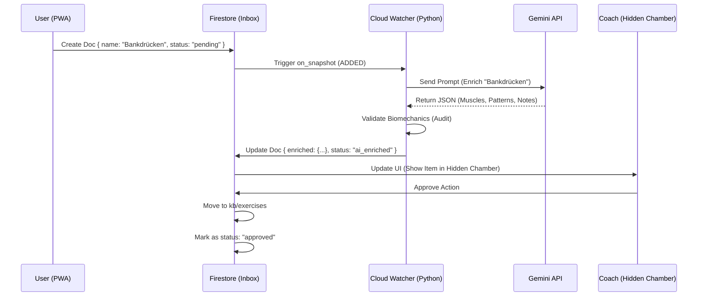

# Inbox Enrichment Workflow

This workflow describes how a raw user input becomes a curated exercise entry.

```mermaid
sequenceDiagram
    participant U as User (PWA)
    participant F as Firestore (Inbox)
    participant W as Cloud Watcher (Python)
    participant AI as Gemini API
    participant C as Coach (Hidden Chamber)

    U->>F: Create Doc { name: "Bankdrücken", status: "pending" }
    F->>W: Trigger on_snapshot (ADDED)
    W->>AI: Send Prompt (Enrich "Bankdrücken")
    AI-->>W: Return JSON (Muscles, Patterns, Notes)
    W->>W: Validate Biomechanics (Audit)
    W->>F: Update Doc { enriched: {...}, status: "ai_enriched" }
    F->>C: Update UI (Show Item in Hidden Chamber)
    C->>F: Approve Action
    F->>F: Move to kb/exercises
    F->>F: Mark as status: "approved"
```
