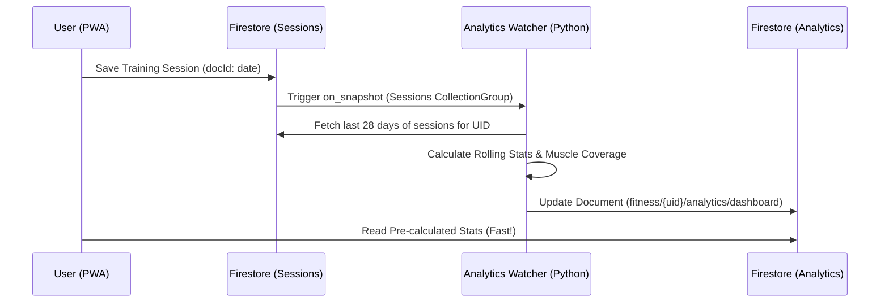

# Analytics Document Schema

Stored at `fitness/{uid}/analytics/dashboard`.
This document is automatically updated by the Cloud Chamber Analytics Watcher whenever a user's session is added, modified, or deleted.

```json
{{
  "last_updated": "timestamp",
  "rolling_28_days": {{
    "total_volume": "number",
    "session_count": "number",
    "exercise_count": "number",
    "body_region_scores": {{
      "chest": "number",
      "back": "number",
      "shoulders": "number",
      "arms": "number",
      "core": "number",
      "legs": "number"
    }}
  }}
}}
```

## Workflow


